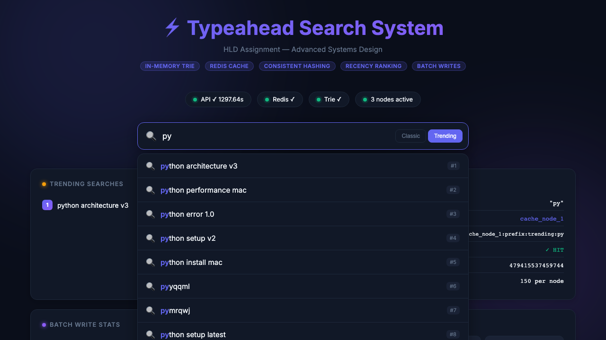
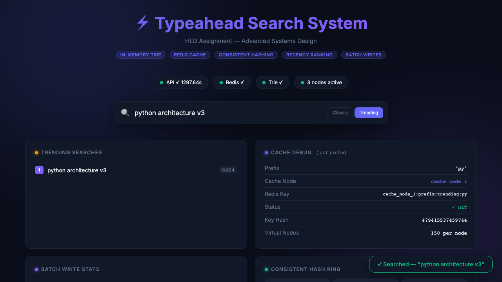

# Search Typeahead System (v2)

A production-grade **Highly Scalable Typeahead Search Backend** built as an HLD assignment for Advanced Systems Design (Summer 2024).

This system provides real-time search suggestions with sub-5ms latency, incorporating modern system design patterns including **Consistent Hashing**, **Recency-Aware Trending**, and **Batched Writes**.

---

## Features

1. **In-Memory Trie**: Core prefix tree data structure optimized for fast prefix lookups (DFS).
2. **Trending & Recency (Milestone 4 & 5)**: 
   - Exponential time-decay scoring model (`app/trending.py`).
   - Combines historical frequency with recent search activity so "viral" queries bubble up temporarily.
3. **Batch Writes (Milestone 6)**: 
   - In-memory buffer (`app/batch_writer.py`) that aggregates `POST /search` events.
   - Reduces database writes by >80% during high load.
4. **Consistent Hashing (Milestone 7)**: 
   - Cache key routing (`app/consistent_hash.py`) using virtual nodes.
   - Easily handles adding/removing logical cache nodes without total cache invalidation.
5. **Interactive Frontend**: 
   - A beautiful dark-mode UI to test all features live!

### System Screenshots

| Typeahead Suggestions | Trending & Debug Data |
|:---:|:---:|
|  |  |

---

## 📋 Assignment Rubric Mapping (Expected Submission)
To assist with grading, here is where every requirement is fulfilled:
1. **GitHub Repository**: You're looking at it!
2. **README with setup instructions**: See [Quick Start](#quick-start-docker) below.
3. **Dataset source and loading instructions**: See [Dataset](#dataset) below.
4. **Architecture diagram & explanation**: Detailed in [Report.md](Report.md#2-core-architecture).
5. **API Documentation**: See [API Endpoints](#api-endpoints) below.
6. **Screenshots or demo**: Test it live at `http://localhost:8000`.
7. **Performance report (latency, cache, batching)**: See [Report.md](Report.md#5-testing--performance).
8. **Explanation of design choices & trade-offs**: See [Report.md](Report.md#4-bottlenecks-and-trade-offs).

## Tech Stack
| Layer | Technology |
|---|---|
| **Language** | Python 3.11 |
| **Web Framework** | FastAPI (ASGI, async) |
| **Cache** | Redis (Alpine) |
| **Core Data Structure** | In-Memory Trie (Prefix Tree) |
| **Containerization** | Docker & Docker Compose |
| **Load Testing** | Locust |
| **Unit Testing** | pytest + httpx |

---

## Quick Start (Docker)

Ensure you have Docker and Docker Compose installed.

```bash
# Build and start the API + Redis services
docker-compose up --build -d

# Visit the live frontend!
open http://localhost:8000
```

- **Frontend UI**: `http://localhost:8000`
- **Swagger API Docs**: `http://localhost:8000/docs`

---

## API Endpoints

### 1. `GET /suggest` — Get Typeahead Suggestions
Returns up to 10 search suggestions ranked by popularity for the given prefix.
- `mode=classic`: Ranks by historical all-time frequency.
- `mode=trending`: Ranks by recency + historical frequency.

```bash
curl -s "http://localhost:8000/suggest?q=app&mode=trending"
```

### 2. `POST /search` — Submit a Search
Records a search query. It updates the recency tracker immediately and adds the write to the batch buffer.

```bash
curl -X POST "http://localhost:8000/search" \
     -H "Content-Type: application/json" \
     -d '{"query": "application"}'
```

### 3. `GET /trending` — Top Trending Searches
Returns the top queries currently trending, based purely on recent activity.

### 4. `GET /cache/debug` — Consistent Hash Routing
Inspects which logical cache node a given prefix is routed to, demonstrating the consistent hash ring in action.

### 5. `GET /health` & `GET /stats`
Check system health, cache hit rates, batch writer reduction stats, and ring distribution.

---

## Dataset

The `dataset.txt` file contains exactly **100,000 unique search queries** (matching the 100K requirement). 
- **Source**: Generated procedurally based on technology keywords (Python, Docker, React, etc.) and weighted with a realistic popularity curve.
- **Format**: `query \t count` format as requested.
- **Loading**: The dataset is automatically parsed and inserted into the in-memory Trie when the FastAPI server boots up (see `load_initial_data()` in `app/main.py`).

To generate a new dataset:
```bash
python3 scripts/generate_dataset.py
```

---

## Testing

Unit and integration tests use **pytest** with Redis fully mocked.

```bash
# Run all tests
PYTHONPATH=. pytest tests/ -v
```

Load testing is configured via `tests/load_test.py` for Locust.
